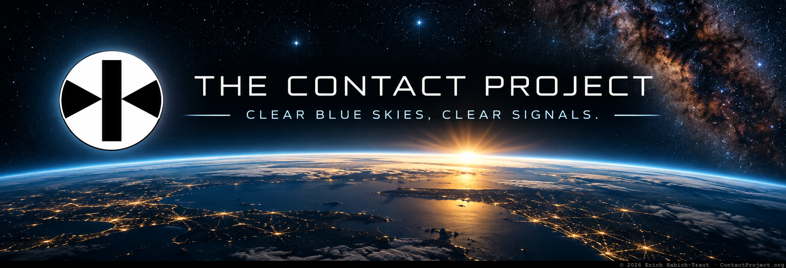

<h1 align="center">THE CONTACT PROJECT</h1>

  <strong>Clear blue skies, clear signals.</strong>  
  Open research · Experimental tools · Reproducible investigations  
  <a href="https://contactproject.org"><strong>ContactProject.org</strong></a>
  &nbsp;·&nbsp;
  <a href="https://github.com/contactproject/GCP2-Experiment-Console"><strong>GCP2 Experiment Console</strong></a>
  &nbsp;·&nbsp;
  <a href="https://github.com/contactproject/UFO-Alert"><strong>UFO-Alert</strong></a>

<h2>What this is</h2>

The Contact Project develops open, testable ways to investigate difficult questions at the edge of current knowledge — from <strong>UAP and anomalous signals</strong> to <strong>consciousness, QRNG experiments, and citizen-operated observation systems</strong>.

<strong>Observe. Question. Verify. Revise.</strong>

Preserve the original evidence. 
Separate observation from interpretation. 
Define experimental conditions in advance. 
Keep uncertainty visible. 
Make the method reproducible.

<h2>Current open-source work</h2>

<h3>🧭 GCP2 Experiment Console</h3>

A Chrome extension for prospective experiments using the public GCP2 live-data system.

It can monitor individual GCP2 nodes, record <strong>Device Coherence (<code>ac</code>)</strong> alongside <strong>Global Network Variance (<code>netvar</code>)</strong>, switch between live nodes, mark <strong>START / EVENT / END</strong> windows, preserve intention notes, visualize the data, and export or back up the resulting dataset.

<strong>→ <a href="https://github.com/contactproject/GCP2-Experiment-Console">View GCP2 Experiment Console</a></strong>

<h3>🛸 UFO-Alert</h3>

An open-source concept for reporting and investigating UAP observations in real time.

<strong>→ <a href="https://github.com/contactproject/UFO-Alert">View UFO-Alert</a></strong>

<h2>Research principles</h2>

<strong>Preserve the record.</strong> Originals matter. 
<strong>Separate observation from interpretation.</strong> 
<strong>Define experimental conditions prospectively.</strong> 
<strong>Keep uncertainty visible.</strong> 
<strong>Make methods reproducible where possible.</strong>

<h2>Current areas of investigation</h2>

<strong>UAP observation</strong> 
<strong>Evidence preservation</strong> 
<strong>Fast-sky-transit capture</strong> 
<strong>Multi-camera triangulation</strong> 
<strong>Anomalous signals & SETI</strong> 
<strong>QRNG / GCP2 methods</strong> 
<strong>AI-assisted research</strong> 
<strong>Consciousness hypotheses</strong> 
<strong>Open research infrastructure</strong>

<h2 align="center">Reality Gets a Veto</h2>

  <strong>
    The goal is not to protect a preferred explanation.  
    The goal is to build a record strong enough that reality can answer back.
  </strong>

  <a href="https://contactproject.org"><strong>Visit ContactProject.org →</strong></a>

